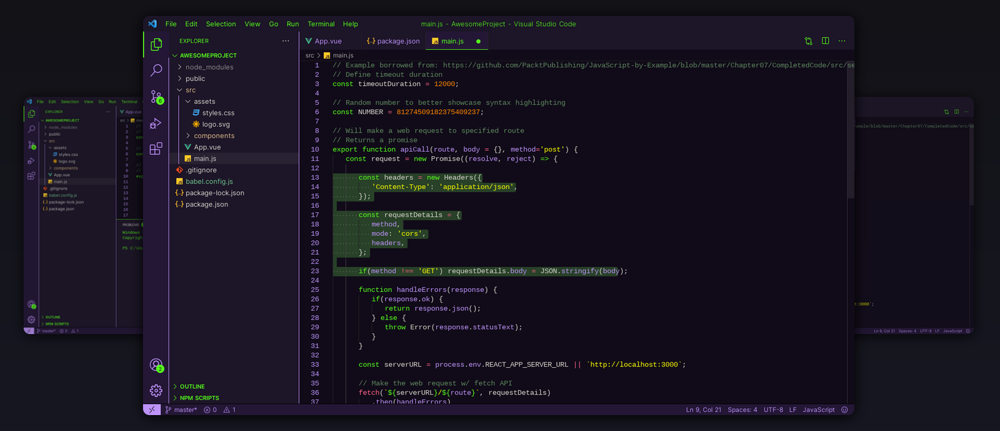

# Joker vscode theme 🃏

> Can you Introduce me as Joker?

A theme inspired by joker and by [this awesome vim theme](https://github.com/arthurealike/vim-J/blob/master/README.md)

## Installation

[Link to vscode marketplace](https://marketplace.visualstudio.com/items?itemName=codingpotions.joker-theme)

- Install Visual Studio Code
- Launch Visual Studio Code
- Choose Extensions from menu
- Search for joker-theme
- Click Install to install it
- Click Reload to reload the Code
- From the menu bar click: Code > Preferences > Color Theme > Joker theme

